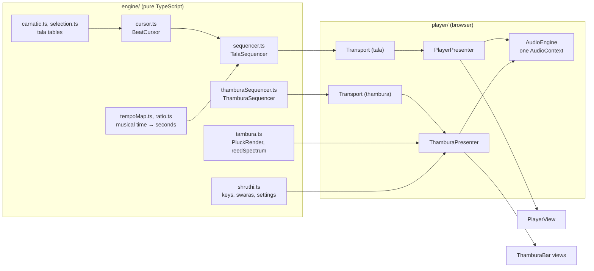
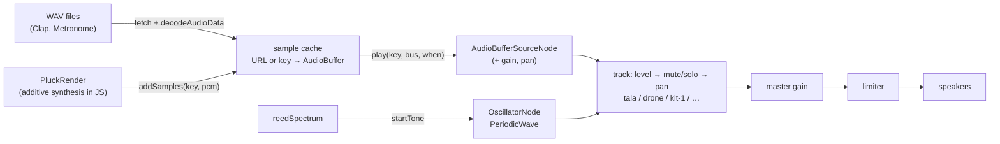
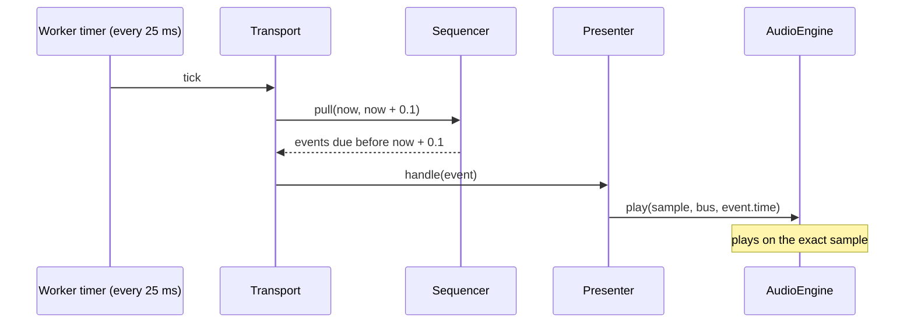

# How Thambura makes sound

Where each sound comes from, how we decide when to play it, how a steady
drone differs from a beat, and what changed from the 2016 Laya Gnana app
this grew out of. CLAUDE.md has the file-by-file notes, and this is the
picture that ties those files together, written once the port had drifted
far enough from the original that the notes alone no longer explained it.

## The layers



`engine/` has no DOM, no audio and no timers. It turns settings into beats,
beats into timed events, and pitches into samples or spectra, and every piece
of it runs under vitest. `player/` holds the browser side. The two presenters
own the state and call `AudioEngine`, and the Solid views render the state and
call the presenters back. A presenter never imports Solid, so its tests drive
it with a fake `AudioOut`, a fake ticker and a fake frame loop.

The tala and the thambura are separate islands on one page. They share one
`AudioEngine`, which means one AudioContext, one audio clock and one mixer.
Each has its own `Transport`, so each starts and stops on its own.

## Where the sounds come from

There are three sources, and all of them end up on one of the engine's buses.



**Recorded samples.** The tala's claps and metronome ticks are short WAV
files under `web/static/Resources/Sounds/`. `TalasFixtures.json` maps the
names a beat uses (`down`, `open`, `one`, `two` …) to those files, one map
per sound group. `AudioEngine.load` fetches and decodes each file once and
keeps the `AudioBuffer` under its URL.

**Rendered samples.** The thambura's plucked modes have no recordings behind
them. `tambura.ts` builds each string's pluck in code as a sum of harmonics.
Each harmonic starts at a level set by the pluck position and a rolloff, then
decays at its own rate, with the high ones dying faster. Two models stand in
for the jawari's bloom:

- The **Tambura** mode (`jawari`) was fitted to a 60 s recording of a C
  tambura (issue #8). A pluck starts dark. Harmonics around 1.3 kHz (a band
  about 1.2 octaves wide) then swell by up to about 40 dB over the first
  second, peak around 1.4 s, fall back within the next second and leave a
  little brightness behind. Most of that is energy moved up from the low
  harmonics, as a jawari does, so the note brightens more than it swells
  (`formantEnergy` 0.3: 30% of the boost is new energy). The low Sa, a
  thicker string, blooms about half as much. Every string is scaled by its
  attack rather than its peak (`attackLevel`), so all four are plucked
  equally hard. Scaling by the peak made a big-bloom string's attack about
  15 dB quieter than a small-bloom one's, which buried the first Sa pluck
  and made the low Sa's stand out.
  Measured the same way, the fitted voice's loudness and spectral centroid
  over time follow the recording's to within a few dB.
- **Tambura (classic)** (`tambura`) sweeps a resonance slowly down through
  the harmonics and lets it wander back and forth a little. Its tone barely
  changes over a pluck. Guitar mode uses the same model, shorter and duller.

The result is
a mono `Float32Array`, 9 s long for a tambura string, and `addSamples` stores
it in the same cache as the WAVs under a key such as
`thambura/130.813/<voice params>`. From there a pluck plays exactly the way a
clap does.

Rendering is quite slow. A 9 s tambura string takes about 40 ms at
48 kHz, which is enough to make the tala late (see the timing numbers
below). `pnpm bench` times it outside the browser, one line per plucked
voice, and every speed change is measured against it (issue #36). It was
twice that until the renderer took four harmonics per pass and stopped
working out the harmonic-independent half of the envelope once per
harmonic. So `PluckRender` works a few harmonics at a time and `ThamburaPresenter` feeds
it about 20 ms of work per `setTimeout`. Any setting that changes the sound
(key, first string, temperament, A4, mode, voice, tone, pluck, sustain) changes the
four keys and starts a new render 60 ms later. The strings keep playing their
old samples until all four new ones are ready. Fine tune doesn't re-render,
because it is applied as `detune` on each note.

**Live tones.** Sruti mode is a reed box, not a plucked instrument, so it has
no samples at all. `reedSpectrum` gives the amplitudes of 24 harmonics, and
`startTone` turns them into a Web Audio `PeriodicWave`. Each of the three
tones (the first string's swara, Sa, upper Sa) is one `OscillatorNode`
playing that wave at its own level and pan until it is stopped. A second,
much slower oscillator (0.12-0.2 Hz) moves each tone's gain up and down by
6%, which is our fairly rough stand-in for the bellows.

**The mixer.** Every note lands on a track, named by an id and made the
first time the id is used (#96). The hand claps play on `hands-1` (#98), the
thambura on `drone`, and each kit on its id from the page, `kit-1` for the
first (#97). A track is a level, squared so the slider
feels even, then an on/off gain for mute and solo, then a pan. Choke groups
belong to a track, so two drums never cut each other off. The tracks sum
into a master gain and then a limiter at -1 dB, so the tala, four ringing
strings and a mridangam together can't clip.

## How timing works

### Two clocks

A browser has two clocks, and neither can do the whole job alone.

- **The audio clock** (`AudioContext.currentTime`) runs on the sound card. A
  note given a start time on it plays on that sample. But nothing can wait
  on it: there is no "call me back at 3.25 s".
- **JavaScript timers** (`setTimeout`, `setInterval`) can call back, but late.
  A busy main thread, garbage collection or a background tab can delay them by
  tens of milliseconds to a whole second.

The fix is the look-ahead scheduler from Chris Wilson's "A Tale of Two
Clocks". A timer wakes up often and only roughly on time. Each time it asks "what is due in
the next 100 ms?" and books those notes on the audio clock, which then plays
them on time.



### The transport

`Transport` (`player/transport.ts`) runs that loop. Every 25 ms it calls
`pull(now, now + 0.1)` on each sequencer it holds and passes the events to
that track's handler. The timer runs in a Web Worker, because browsers slow a
background tab's main-thread timers to about once a second, and a 100 ms
look-ahead would run dry long before that.

With those numbers a tick can be up to 75 ms late (the 100 ms
window minus the 25 ms interval) before any note misses its time. A note that
does miss is clamped to `currentTime` and plays at once, and the notes after
it stay on the grid, since their times came from the grid and not from when
the timer fired. This margin is why nothing may hold the main thread for
longer than about 75 ms, and why plucks render in 20 ms slices.

The 25 and 100 ms are the article's defaults, and we haven't tuned them.
Tempo isn't capped by the window either. At 300 bpm in sankeernam, ticks are about
22 ms apart, several land in one pull, and each still gets its own exact
time.

### Sequencers

A sequencer (`engine/sequencer.ts`) is anything that answers three calls:

```ts
interface Sequencer<E> {
  start(at: number): void;
  stop(now: number): void;
  pull(now: number, until: number): E[];
}
```

Each event comes out exactly once. Times are in audio-clock seconds.

**`TalaSequencer`** walks a `BeatCursor` through the tala's beats, repeating
each one kalai times, and works in musical time rather than seconds. Every
event has a position `at`, counted in beats of the tempo since Start, as an
exact fraction (`ratio.ts`). A beat gives a `StepEvent` at its start, for the
image, and a `TickEvent` for each sound in it, at the beat's start plus the
nadai's accent offset times the beat's length. A Misra Chaapu's third tick,
for instance, sits at 3/7 of 7/2, which is exactly 3/2 counts in. We use
fractions because floats summed over an hour drift a little, and two voices
reaching the same point by different sums should agree exactly.

The sequencer turns a position into seconds only when that event is pulled,
through the transport's shared `TempoMap`. Each tick is its own event, so a
long beat isn't booked all at once. A Misra Chaapu at 10 bpm is a single
21 s beat, and a tempo change still reaches the ticks later in it. (Before
the map, the sequencer booked a whole beat as soon as its start was in the
window, so those ticks were fixed up to 21 s ahead.) On stop, the sequencer
rewinds the cursor to the first step that hadn't started yet, so Start picks
up where the student stopped hearing, not a beat or two past it.

### The tempo map

`TempoMap` (`engine/tempoMap.ts`) converts musical time to seconds for every
voice on one transport. `Transport.start` puts count 0 at the start time,
and after each tick the transport tells the map how far it has pulled, the
horizon. A tempo change takes effect at the horizon. Everything before it has
already been handed out and booked, so nothing booked moves, and the new
tempo is heard within one 100 ms window. It can land in the middle of a
beat: going from 60 to 120 bpm in the browser gave beat gaps of 1, 1, 1,
0.62, 0.5, 0.5 s, the 0.62 being the beat that straddled the change.

We built the map mostly for the mridangam. With each sequencer adding durations to
its own clock, as the tala did before, two voices would switch tempo at their
own next event and drift apart, since a one-count beat and a 7/2-count
chaapu beat don't end together. On one map, a stroke and a clap at the same
position always get the same time. `player/transport.test.ts` checks this
with Adi and Misra Chaapu through three tempo changes.

**`ThamburaSequencer`** has nothing to do with the tala's tempo. It plucks
first string, Sa, Sa, low Sa in a pattern. The classic tambura and the guitar
use five equal slots, the last one a rest. The jawari tambura uses the
recorded player's rhythm (30%, 20.5%, 20.5% and 29% of the round; see
[sound-analysis.md](sound-analysis.md)) and also emits a
damp event for each string, 9-16% of the round before its next pluck, which
the presenter turns into a 0.2 s fade (`AudioOut.damp`), like a finger
stopping the string. The round's length (2-8 s) is its own setting. The
sequencer doesn't precompute a grid. It works out the next event from the
last pluck only when that event is pulled, so a speed change is heard at the
very next pluck. Each pluck gets up to 0.4% of the round of lateness and up
to 15% less force, so no two rounds are identical.

### Stopping

When Stop is pressed, up to 100 ms of notes are already booked on the
audio clock, so stopping means taking some of them back. `AudioEngine.cancel(bus)` stops every note on the bus that
hasn't started and undoes any fade it had booked on the note before it. A
note already sounding is left alone, because cutting a waveform mid-cycle
clicks. That is all the tala does. The thambura also calls
`release("drone", 1.5)`, which fades whatever is still ringing over about
1.5 s, as a player's hand damps the strings.

### Showing what you hear

The images and the thambura's string lights follow what reaches the
speakers, not what was booked. Each scheduled event leaves a cue with its
audio time. A `requestAnimationFrame` loop compares the cues with
`heardNow`, the audio clock minus the output latency, and shows each cue once
its time has passed. So an image appears with its clap rather than when it
was booked, up to 100 ms earlier. The output latency is taken off as well,
at least as far as the browser reports it (Safari mostly doesn't, and
Bluetooth headphones add 150-250 ms).

## Timed sounds and continuous sounds

The tala, the thambura's plucks and the coming mridangam are *timed*: each
sound is a separate event at a moment in time. Sruti mode is *continuous*:
one sound that starts once and changes while it plays. They use different
halves of Web Audio.

| | Tala click | Tambura pluck | Mridangam stroke (planned) | Sruti tone |
|---|---|---|---|---|
| Source | WAV file | PCM rendered in JS | WAV takes per stroke | `OscillatorNode` + `PeriodicWave` |
| Web Audio node | `AudioBufferSourceNode`, one per note | same | same | one oscillator per tone, for as long as it plays |
| Who decides when | `TalaSequencer` via `Transport`, played by the hands track | `ThamburaSequencer` via its own `Transport` | a stroke sequencer on the tala's timeline | nobody: it starts on Start |
| Clock | the tala's `TempoMap` | thambura speed | the tala's `TempoMap` | none |
| Track | `hands-1` | `drone` | the kit's id (`kit-1`) | `drone` |
| A tempo or speed change | within 100 ms | next pluck | within 100 ms | n/a |
| A pitch change | n/a | after a re-render | n/a | glides in about 30 ms |
| Overlap | none needed | a re-pluck chokes the same string over 80 ms | damped strokes choke ringing ones on the same head | n/a |
| Stop | cancel what hasn't started | cancel, then 1.5 s release | cancel, short release | gain glides to zero, then stop |

The timed voices share one shape: a sequencer emits events, the transport
books them ahead, and each event becomes a fresh `AudioBufferSourceNode`
that plays once and is thrown away. A change can only affect notes not yet
booked, so it lands past the look-ahead horizon. Everything that shapes
a timed note (sample, time, detune, gain, pan, choke group) is fixed when it
is booked.

A continuous voice has no events and no transport. Start creates its
oscillators, and they run until Stop. A change goes straight to the
oscillator's `AudioParam`s with `setTargetAtTime`, a glide with a 30 ms time
constant, so a new key or fine tune bends into place instead of jumping or
waiting for a boundary. Changing the tone swaps the `PeriodicWave` in place.
Stopping ramps the gain to zero and stops the oscillators a moment later.

Long timed notes need one more piece that clicks don't. A classic tambura string rings for 12-36 s,
far longer than a round, so the same string is still sounding when it is
plucked again. (The jawari tambura damps its strings first, as the recorded
player did, and a damped note is left out of the choke.) The re-pluck fades the old note out over 80 ms as it starts,
the way a finger on a string stops its old vibration, instead of letting two
copies stack up. Each choked note needs its own gain node to fade, which is why
`play` adds one whenever a note has a choke group. The mridangam will need the
same thing for a different reason: a damped stroke (a `thi` or `ta`) cuts a
ringing `dhin` on the same head.

## What changed from the original

The 2016 app (the `pre-sadhana-port` tag, jQuery and Bootstrap on the old
App Engine Go runtime) had the same tala tables and the same WAV files. Its
player was pretty small, about 40 lines in `static/js/lgcore.js`, and this
is the heart of it:

```js
lg.BeatPlayer.prototype._nextStep = function() {
  if (this.playing && this.generator != null) {
    var beat = player.generator.currentBeat();
    player.playCurrent();             // show image, start ticks at currentTime + offset
    var nextBeatDelay = beat.totalDuration * player.beatDuration * 1000;
    player.generator.forward();
    setTimeout(function() { player._nextStep(); }, nextBeatDelay);
  }
};
```

| | 2016 | Now |
|---|---|---|
| When a beat starts | whenever `setTimeout` fires | on a grid on the audio clock |
| Timer lateness | shifts that beat, and every beat after it | absorbed by the 100 ms look-ahead |
| Drift over a long session | accumulates, one late timer at a time | none; each beat's time is the last one plus its duration |
| Background tab | timers throttled to 1 s, so the tala stalls | worker timer keeps it going |
| Image | set when the timer fires, before the sound is heard | set when `heardNow` reaches the beat |
| Stop then Start within a beat | the old timer is still pending and sees `playing` true again, so two chains can run | Transport owns the only timer |
| Stop | notes already booked still play | booked-but-unstarted notes are cancelled and the cursor rewinds to them |
| Randomness (SaRiGaMa) | one global `currentRandom`, redrawn on every cursor move | dropped, with the SaRiGaMa groups it served |
| Mixing | one gain node | per-voice buses, master gain, limiter |
| Drone | none | the thambura: rendered plucks and reed tones |
| Code | jQuery objects mixing timing, DOM and audio | pure engine, presenters, Solid views |
| Tests | none | vitest across the engine and both presenters |

What stayed the same: the tala tables, the fixture format and its sound and
image groups, the squared volume curve, and beats that carry fractional tick
offsets within them.

## Known limits

The thambura has been checked by ear and tuned that way
([sound-analysis.md](sound-analysis.md)), and the mridangam's strokes and its
Adi pattern against the tala were heard in Chrome on 2026-09-21. Everything
else is still numbers, because headless Chromium has no audio device: pitch
within a cent, decay tables, and the `when` of each
`AudioBufferSourceNode.start` call. The limits we know about are these.

- **Only the tala is on the tempo map so far.** A mridangam sequencer will
  also need to read the tala's position (which beat of which cycle) for
  eduppu and korvai alignment. It can work that out from the same counts,
  but nothing exposes it yet.
- **Tambura renders stop at 9 s**, and a re-plucked string chokes its old
  ring. In the recording from issue #8 the player stopped each string
  0.5-1 s before plucking it again, so the jawari tambura never needs more.
- **Rendering is on the main thread**, sliced to stay inside the 75 ms margin.
  A worker would take it off entirely (issue #8).
- **Output latency is only what the browser reports**, so on Safari or
  Bluetooth the images can lead the sound. A calibration setting is in
  NEXTSTEPS.md.
