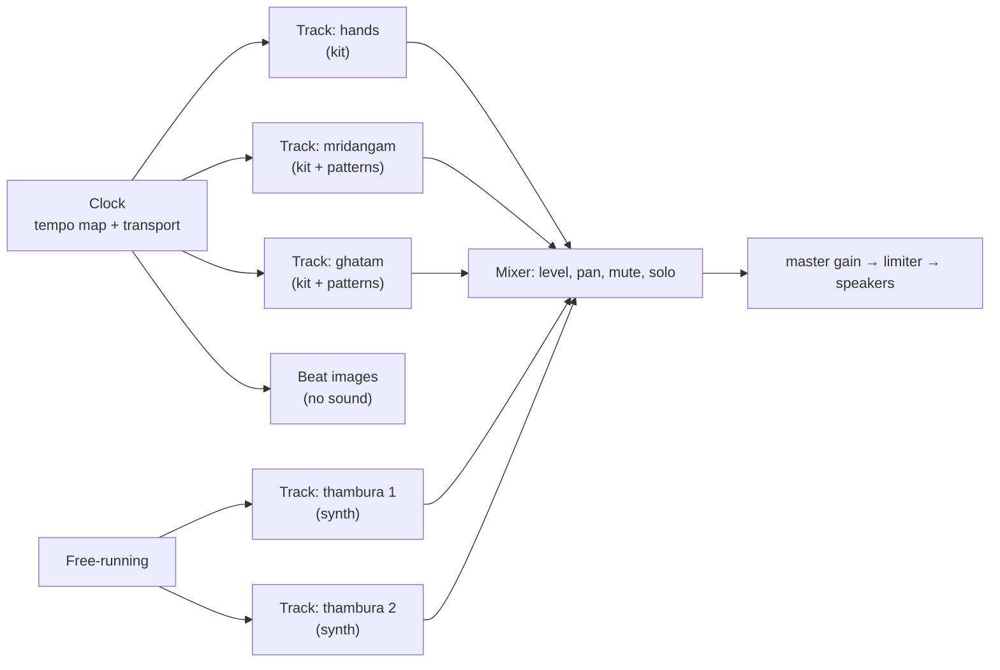

# Instruments and the mixer

Where the app is heading: a mixer of instruments, driven by one clock. You
pick a shruthi and a tala, then add what you want to practise against. Two
thamburas, a mridangam, a ghatam, a kanjira, a set of drums, the hand claps.
Each has its own level, and the tala keeper is the timer they all follow
rather than a player in its own right.

`architecture.md` is how the app works today. This is the shape it grows
into, and what each step costs.

## Where we already are

Rather more of this exists already than the names suggest.

- **The clock is built.** `TempoMap` plus `Transport` is a shared musical
  timeline: voices emit events at exact positions and the map turns those
  into audio seconds. A tempo change lands past the look-ahead horizon, at
  the same instant for every voice. That is the mixer's spine, and the tala
  and a mridangam sharing it is already tested.
- **Struck instruments are already generic.** `engine/kit.ts` knows about
  zones, packs and strokes, not about mridangams. A ghatam or a tabla is a
  different `kit.json`, not different code.
- **The mixer has tracks** (#96): a track id makes its own level, mute,
  solo and pan on first use, into a master gain and a limiter. The three
  used today are still named `tala`, `drone` and `percussion`.

What's in the way now is mostly naming rather than depth: the instruments
still play on those three shared names rather than a track each, and the tala
player schedules its own clap sounds instead of a track doing it.

## The shape

**A track is one instrument playing.** It has a source, a level, a pan, mute
and solo, and a panel of its own. Two tracks can hold the same instrument,
which is what makes two thamburas possible.

**Sources come in two kinds.** A *kit* plays recordings (mridangam, ghatam,
kanjira, hands). A *synth* renders its own sound (the thambura today, and
whatever the pluck-model work in issue #52 brings). The mixer doesn't care
which.

**Tracks follow one of two clocks**, and this is the distinction worth
naming rather than treating as an exception:

- **Metrical tracks** run on the tala's tempo map. A stroke at akshara 3 of
  cycle 2 is at a fixed musical position, so every metrical track stays in
  step through a tempo change.
- **Free-running tracks** have their own speed. A thambura's round is 2 to
  8 seconds and has nothing to do with the tala's tempo. Its plucks, and the
  sruti drone's continuous tones, are free.

**The tala keeper stops being a player.** Today `PlayerPresenter` resolves
clap sounds from the fixture's groups and schedules them itself. It becomes:

- the **clock**, which it already owns,
- a **beat grid** (which cycle, which akshara, which anga) that anything can
  read, which the mridangam needs anyway for eduppu and korvai,
- a **hands track**, a kit like any other, whose strokes are the claps, the
  finger counts and the waves,
- the **beat images**, which are a consumer of the clock and make no sound.

Nothing about that changes what a student sees today. It's the same claps, on
the same grid, with the sound moved out of the timer.

## What has to change

| Piece | Today | Becomes |
|---|---|---|
| Buses | ~~three fixed names~~ | one per track, made on first use (done, #96) |
| `AudioOut` | ~~`setBusVolume(bus, percent)`~~ | `setLevel`, `setPan`, `setMute`, `setSolo`, `removeTrack` per track (done, #96) |
| Tala sounds | the player schedules them from fixture groups | a hands kit on a track |
| Beat grid | inside `PlayerPresenter` | `TalaGrid`, read by any track (already needed for step 2) |
| Thambura | one presenter, one localStorage key, one `?s=` link | one per track, with an id |
| Views | a page with a player and a floating bar | a track list, each track with its own panel |

The thambura row is the expensive one, as far as we can tell. Its settings, its presets and its
share links all assume there is exactly one. A second one means ids in the
saved state and in the link format, and the link format is the part people
have already got copies of, so it needs to stay readable when it carries one
track.

**Multi-instance, limited to one for now.** We'd rather the data model and the
presenters took an instance id from the start, and the UI offers a second thambura only
once it's cheap enough to add. That way the format work happens once, and the
limit moves when the numbers say it can.

**What "cheap enough" means.** A cold Start renders four strings in about
300 ms on a fast desktop, and that render is already the slowest thing in the
app. A second thambura doubles it. The issues to finish first are #38 (four
harmonics per loop), #39 (Web Workers, strings in parallel) and #40 (an
IndexedDB cache between visits). With a cache, a second thambura at a pitch
you've used before costs almost nothing. So: benchmark first (#37), then
allow the second instance when the numbers land, rather than because the UI
is ready.

## The pads: drawn per instrument

The stroke pad is a fallback grid today: buttons grouped by zone. Each
instrument should be able to draw itself instead, with the strokes where they
actually are. Two heads for a mridangam, the dayan and bayan for a tabla, one
pot for a ghatam with the bass near the mouth, several pieces for a drum kit.

That belongs in the manifest, next to the zones, as an optional `layout` with
a view box, a shape per zone and a spot per stroke. The pad draws the shapes,
puts each stroke's spot on its zone, and keeps the grid for any kit that
declares no layout. Nothing about it is instrument-specific in the code, and
an old kit keeps working, which is why it can wait until after the strokes
are playing.

A layout also gives the sequencer something to show: the spot lights when its
stroke is heard, which is how you see what a phrase is doing.

## The open question: views

The order below assumed each instrument brings the panel it has today, the
thambura's floating bar and the mridangam's section. That is the part most
likely to change. With several instruments, what a track shows when it is
collapsed, which of an instrument's views a track is set to, and how the page
remembers that arrangement are all decisions nobody has made, and they decide
what a track is in the UI rather than in the audio graph.

Worth settling before the mixer is built, since the mixer is easy once a
track has a shape.

## The order

Each step stands on its own, and the early ones are already in the mridangam
plan (`mridangam.md`).

1. **The mridangam through step 3** of its own plan: the stroke sequencer on
   the tala's clock, the pattern format, a library of patterns. This is the
   first metrical track, and it proves the clock carries someone else's
   events.
2. **`TalaGrid`**, needed by that sequencer anyway, which is what lets a
   track ask where it is in the cycle.
3. **Tracks and the mixer**: a bus per track, level, pan, mute and solo, and
   a track list in the view. The thambura and the mridangam move onto it
   unchanged.
4. **The hands become a track**, and the tala keeper becomes the clock, the
   grid and the images. The fixture's sound groups become a hands kit.
5. **Instance ids** through the thambura's settings, presets and share links,
   still limited to one thambura.
6. **Drawn pads** from a manifest layout.
7. **A second thambura**, once the render numbers allow it.
8. **More instruments as kits**: ghatam, kanjira, a drum kit. By then adding
   one is a recording session and a manifest, not code.

## What this doesn't change

- The app stays static, with no server-side data. Tracks, their settings and
  their patterns live in the browser and travel in links.
- One `AudioContext`, one limiter, one look-ahead scheduler. A mixer is more
  gains on the graph we already have, not a second engine.
- Practice comes first, as it has so far. A track list is worth having when it helps someone
  practise against a mridangam and a drone at once, not because a mixer is a
  nice thing to build.
