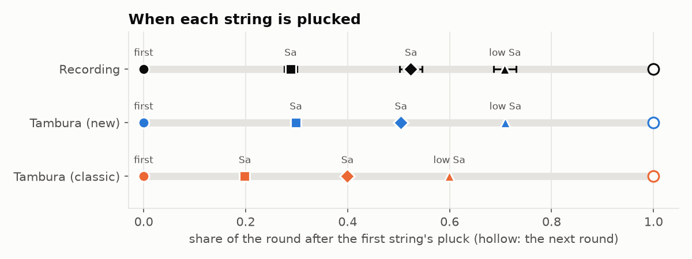
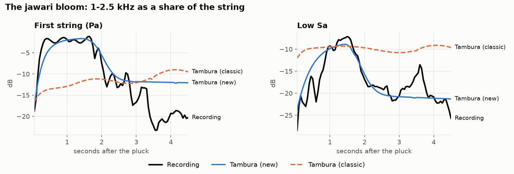
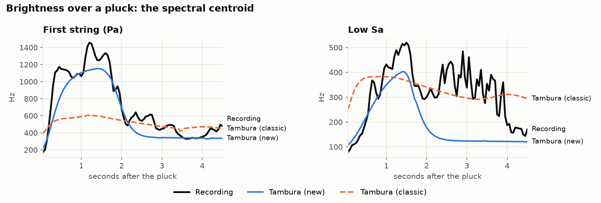
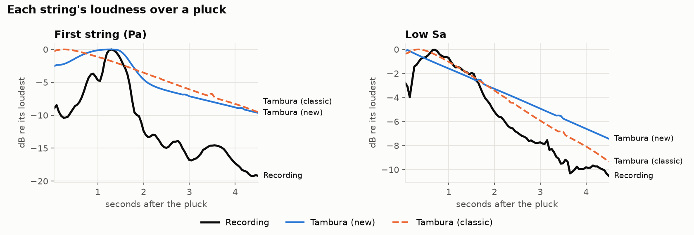
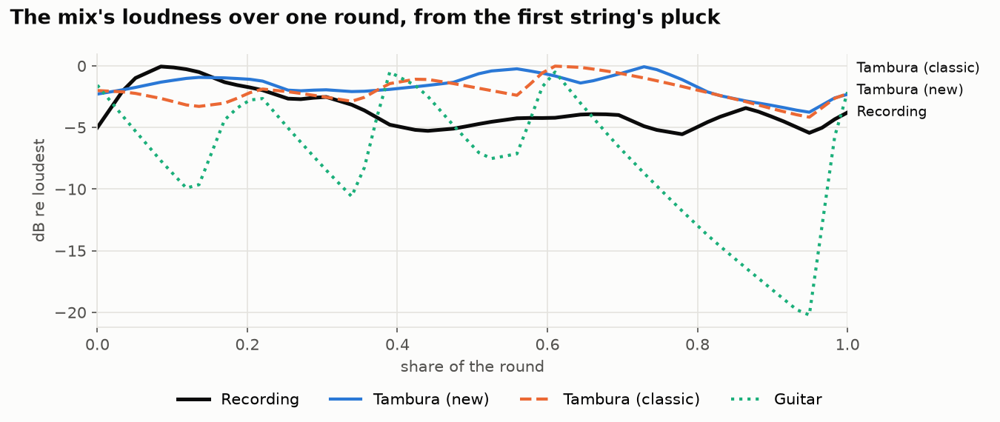
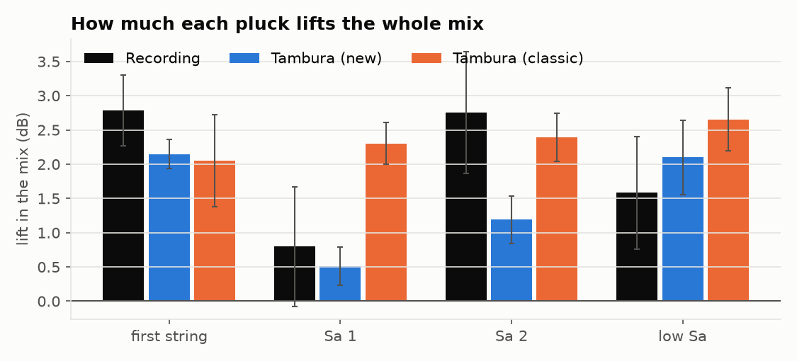
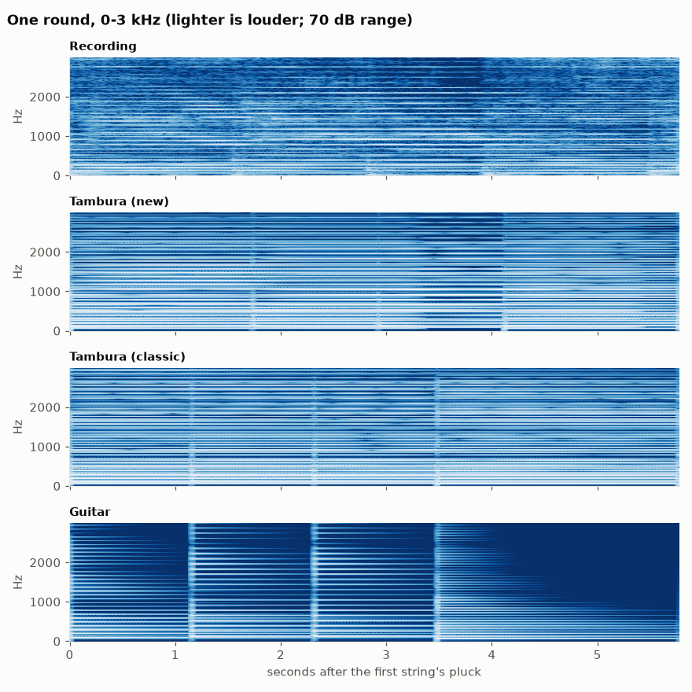

# Tambura sound analysis

How the "Tambura" voice (mode `jawari`) was fitted to a recording of a real
tambura, with the tools to do it again. The recording was 60 s of a C
tambura. Nothing from it ships: the app still synthesizes every pluck (see
"Rendered samples" in [architecture.md](architecture.md)), and the recording
only served as the thing to measure against. Issue #8 tracks the sound work.

Everything here runs from the repo:

| Tool | What it does |
|---|---|
| `pnpm render-mix` (in `web/`) | Plays the app's thambura offline, through the real engine code, and writes a WAV plus a JSON of every pluck and damp. |
| `tools/sound-analysis/analyse.py` | Prints every measurement for one file, a recording or a render. |
| `tools/sound-analysis/compare.py` | Measures the recording and the renders together and draws the charts on this page. |
| `tools/sound-analysis/fit.py` | Fits the jawari voice's bloom to a recording. |
| `tools/sound-analysis/soundlab.py` | The measurements themselves, shared by the three scripts. |
| The Lab view (in the app) | Every number of the plucked sound, string by string, to tune by ear. Exports JSON that `render-mix --custom` plays. |

## Setup

You need Python 3.10 or later and the web toolchain (`make ui` has already
installed it if you've built the app). The Python packages are numpy, scipy,
soundfile and matplotlib. soundfile wraps libsndfile, which reads WAV, FLAC,
OGG and MP3, so no ffmpeg is needed.

```sh
cd tools/sound-analysis
python3 -m venv .venv
.venv/bin/pip install -r requirements.txt
```

The tested versions were Python 3.12, numpy 2.5, scipy 1.18, soundfile 0.14
and matplotlib 3.11. `.venv/` is gitignored.

Recordings go in `recordings/` at the repo root, which is gitignored too:
they're someone else's audio and they're large. The one used here was
`recordings/tambura-C.mp3`.

## Running the analysis

**1. Find the tuning.** With no `--sa`, `analyse.py` lists the strongest
spectral peaks:

```sh
.venv/bin/python analyse.py ../../recordings/tambura-C.mp3
```

For the C recording the top peaks were 131.05 Hz (Sa), 196.8 Hz, 261.7 Hz and
65.4 Hz (the low Sa). The first string is usually Pa an octave down. You can
confirm that from its odd harmonics, which fall between the Sa series: 295,
493, 690 and 887 Hz show up here, which is Pa at about 98.3 Hz.

**2. Measure the recording.**

```sh
.venv/bin/python analyse.py ../../recordings/tambura-C.mp3 --sa 131.05
```

For a first string other than Pa, pass `--first` with the swara's ratio to
Sa, halved (Ma 0.667, Ni 0.9375). The output covers the pluck timing, how
much each pluck lifts the mix, the mix's level over a round, the first
string's and the low Sa's tables over time, and when each string is damped.

**3. Render the app's voices.**

```sh
cd ../../web
pnpm render-mix                          # jawari, tambura and guitar at C3, 5.8 s rounds, 30 s each
pnpm render-mix --modes jawari --key G3 --cycle 4.5 --tone 70
```

The files land in `recordings/renders/` as `<mode>.wav` and `<mode>.json`.
`render-mix` runs `mixThambura` (`web/src/tools/thamburaMix.ts`). That uses
the mode's plan (`planFor`), the presenter's own per-pluck options (`pluckOptions`), the sequencer, the
80 ms choke and the 0.2 s damp, so the mix plays like the browser does,
without the limiter. The render also makes a good listening copy. Pass
`--cycle` (seconds a round) to match a recording's speed; 5.8 s is the C
recording's, and the default.

**4. Measure a render.** `analyse.py` reads the JSON beside a WAV for the
pitches and pluck times, so no `--sa` is needed:

```sh
cd ../tools/sound-analysis
.venv/bin/python analyse.py ../../recordings/renders/jawari.wav
```

**5. Compare them and draw the charts.**

```sh
.venv/bin/python compare.py            # defaults: recordings/tambura-C.mp3 at Sa 131.05, recordings/renders
```

This writes the PNGs in `docs/images/sound-analysis/` and prints the tables
below. Re-run it after changing a voice. It takes a few seconds.

**6. Refit, if you have a new recording.**

```sh
.venv/bin/python fit.py ../../recordings/tambura-C.mp3 --sa 131.05
```

This takes about 40 s. It prints the fitted parameters and the model beside
the recording, band by band. "Fitting" below explains how its numbers turn
into `pluckVoice`.

**7. Tune by ear in the Lab, then measure.** Open the thambura bar, pick the
Lab view, choose a starting sound under "Start from" and press Load. That
copies the mode's plan into the Custom mode, which sounds the same until you
change something. Each string has its own tab (level, force, attack, ring,
bloom and so on), and the rhythm sliders set the gaps. The Sound switches to
Custom as soon as you touch anything. When it sounds right, press "Copy
settings" and save the JSON, say as `recordings/lab.json`, then:

```sh
cd ../../web
pnpm render-mix --custom ../recordings/lab.json     # writes recordings/renders/custom.wav
cd ../tools/sound-analysis
.venv/bin/python compare.py                          # adds "Custom (Lab)" to the tables and charts
```

For example, raising only the second Sa's level from 0.7 to 1.0 (+3 dB)
takes its pluck lift from +1.2 dB to +2.2 dB, against the recording's
+2.8 dB. Delete `recordings/renders/custom.*` to take it out of the charts
again. Pasting JSON into the Lab's "Settings JSON" box loads it back, so a
sound can travel both ways.

To share a sound with other listeners, send the page's address: the `?s=`
parameter carries the whole setup, the Custom plan included, and the bar's
link button copies it. Opening it plays the same sound in the same view.

## How the measurements work

**One mono mix, four strings.** A recording is a mix of all four strings, so
each string is followed through the harmonics that only it has. The low Sa is
an octave below Sa, so every Sa harmonic is also an even harmonic of the low
Sa, and the Sa strings can't be followed on their own. The first string's
odd harmonics fall halfway between the low Sa's, 33 Hz from the nearest one
at C. The low Sa's odd harmonics that stay clear of the first string's work
the same way. `own_harmonics` keeps the ones at least 25 Hz from every
other string's harmonic. That leaves 36 for the first string and 35 for the
low Sa at C.

**Spectrogram.** An 8192-sample window (186 ms at 44.1 kHz), stepped every
10 ms. That resolves harmonics 5 Hz apart. The price is a smeared attack:
anything measured in the first 0.1 s after a pluck is blurred over about
0.1 s. Each harmonic's power is read from the three bins around its peak.
The peak is searched within ±0.8% of the expected frequency, because a real
string's upper harmonics run a little sharp, but never more than ±10 Hz, so
the search can't reach a neighbouring string.

**Finding the plucks.** Renders list theirs in the JSON. In a recording:

- The first string and the low Sa: their own harmonics jump 25-40 dB within
  0.12 s. Rises over 10 dB count.
- The first Sa: the most prominent rise in the Sa harmonics that the first
  string doesn't share (Pa's 4th harmonic is Sa's 3rd). The search runs
  between a first-string pluck and the next low Sa.
- The second Sa: it's tuned to the first Sa, which is still ringing, so it
  hardly shows in the Sa harmonics. It shows as a rise across the whole
  spectrum, 60 Hz-5 kHz, between the first Sa and the low Sa.

Plucks in the first and last 6 s are dropped, since the recording fades in
and out there.

**What's measured, per string.** Each is averaged over the plucks, relative
to the string's own pluck:

- *level*: the power in its harmonics, in dB below its loudest moment.
- *1-2.5 kHz share*: the power in its harmonics between 1 and 2.5 kHz, in
  dB relative to all of them. This is where the jawari's bloom shows.
- *centroid*: the power-weighted mean frequency of its harmonics, a single
  number for brightness.
- *bands*: the power in seven frequency bands (0-250 Hz up to 4-7 kHz).
  `fit.py` fits these.
- *damp lead*: the steepest 0.3 s fall in its harmonics, measured from 3 s
  after the pluck, as seconds before its next pluck.

**What's measured on the whole mix.**

- *level over a round*: RMS in 0.25 s steps from each first-string pluck,
  averaged over rounds.
- *pluck lift*: the loudest 30 ms in the 0.2 s after a pluck, against the
  0.23 s before it. This is how much a pluck stands out.

## Results

The recording against the three plucked voices at C3, all at the
recording's 5.8 s round. The guitar is a different instrument: it's in the
tables and the round chart but not the per-string charts. Its strings fade
40-60 dB, low enough that the other strings' plucks leak into the
measurement.

### Timing



| When each string is plucked (share of the round after the first string) | Recording | Tambura (new) | Tambura (classic) |
|---|---|---|---|
| Sa 1 | 0.288 ±0.012 | 0.298 | 0.198 |
| Sa 2 | 0.524 ±0.022 | 0.504 | 0.399 |
| low Sa | 0.708 ±0.022 | 0.709 | 0.599 |

The player spaced the plucks unevenly: a long gap after the first string, a
shorter one between the Sa strings, the shortest before the low Sa, then a
long one back to the first string (0.288, 0.236, 0.184 and 0.292 of the
round). The classic voice uses five equal slots with a rest after the low Sa,
like an electronic tambura. The new voice uses `PLAYED_PATTERN`: 0.30 after
the first string and 0.29 after the low Sa, as measured, but the two Sa
strings share the time between evenly (0.205 each). With the recording's
spacing, the first Sa's note lasted about 1.4 times the second's, and by ear
that stood out more than it helped.

The player also stopped each string before plucking it again: the first
string 0.63 s before (median; 0.34-0.93), the low Sa 0.96 s before
(0.23-1.11). The new voice damps them 0.52 s and 0.93 s ahead at a 5.8 s
round (9% and 16% of the round). The analysis reads those as 0.39 and 0.82,
because the fade starts at the damp and runs 0.2 s. The classic voice lets
every string ring into its own next pluck.

### The bloom





| First string (Pa), seconds after its pluck | 0.05 | 0.4 | 1.0 | 1.3 | 1.6 | 2.0 | 2.5 | 3.0 | 4.0 |
|---|---|---|---|---|---|---|---|---|---|
| 1-2.5 kHz share, recording (dB) | −19 | −2 | −2 | −2 | −1 | −7 | −13 | −17 | −19 |
| 1-2.5 kHz share, Tambura (new) | −17 | −5 | −2 | −2 | −2 | −6 | −11 | −12 | −12 |
| 1-2.5 kHz share, Tambura (classic) | −17 | −14 | −13 | −12 | −11 | −11 | −12 | −12 | −9 |
| centroid, recording (Hz) | 175 | 1130 | 1064 | 1378 | 1334 | 683 | 540 | 449 | 354 |
| centroid, Tambura (new) | 220 | 725 | 1105 | 1145 | 1115 | 694 | 370 | 344 | 338 |
| centroid, Tambura (classic) | 395 | 550 | 590 | 601 | 582 | 545 | 510 | 475 | 471 |
| centroid, guitar | 333 | 214 | 170 | 169 | 169 | 162 | 147 | 132 | 115 |

| Low Sa, seconds after its pluck | 0.05 | 0.4 | 1.0 | 1.3 | 1.6 | 2.0 | 2.5 | 3.0 | 4.0 |
|---|---|---|---|---|---|---|---|---|---|
| 1-2.5 kHz share, recording (dB) | −28 | −18 | −9 | −8 | −8 | −17 | −19 | −21 | −21 |
| 1-2.5 kHz share, Tambura (new) | −24 | −15 | −10 | −9 | −10 | −16 | −20 | −21 | −21 |
| 1-2.5 kHz share, Tambura (classic) | −12 | −10 | −9 | −9 | −9 | −10 | −10 | −11 | −9 |
| centroid, recording (Hz) | 79 | 153 | 432 | 470 | 471 | 300 | 409 | 339 | 187 |
| centroid, Tambura (new) | 106 | 189 | 349 | 394 | 358 | 178 | 128 | 123 | 121 |
| centroid, Tambura (classic) | 250 | 371 | 382 | 376 | 361 | 341 | 316 | 296 | 311 |

A real pluck starts dark: the first string's centroid is under 200 Hz at
the attack. Within half a second the 1-2.5 kHz band climbs about 17 dB, to
roughly half the string's power, and the centroid passes 1 kHz. It holds
until about 1.6 s, then falls back within the next second. That swell is the
jawari: the string grazes the curved bridge, and energy moves from the low
harmonics up into a band around 1-2 kHz. It's in the same place in Hz for
the first string and the low Sa, which is why the new voice sets it in Hz
(`formantHz`) rather than in harmonic numbers. The low Sa's rises to about
−8 dB, against the first string's −2 dB, so the new voice gives the low Sa
about half the depth.

The classic voice's resonance sweep stays at the same brightness for the
whole ring. The guitar starts brighter and dulls, as a plucked guitar string
does.

The recording's low-Sa centroid after 2 s jumps around, 300-400 Hz. That's
the first string's next pluck, 1.7 s after the low Sa, leaking in at a
level where the low Sa is quiet. Treat it as noise.

### Loudness







| The whole mix | Recording | Tambura (new) | Tambura (classic) | Guitar |
|---|---|---|---|---|
| level range over a round (dB) | 5.6 | 3.8 | 4.2 | 20.6 |
| first-string pluck lift (dB) | +2.8 | +2.1 | +2.1 | +21.3 |
| Sa 1 pluck lift | +0.8 | +0.5 | +2.3 | +12.8 |
| Sa 2 pluck lift | +2.8 | +1.2 | +2.4 | +13.9 |
| low Sa pluck lift | +1.6 | +2.1 | +2.7 | +11.3 |

A tambura is a drone: over a round the recording's level moves about 6 dB,
and each pluck lifts the mix by only 1-3 dB. The first string's level chart
shows it about 10 dB louder at its bloom than at its attack, but that is
only its odd harmonics, the ones that brighten. The whole mix barely swells.

### One round



The spectrograms show the plucks' character. In the recording a pluck
brightens the low harmonics and the bloom fills in over a second, with no
vertical edge. The renders show a thin line through every frequency at each
pluck. The synthesized attack rises in 4-10 ms, and that fast rise puts
energy between the harmonics. The guitar's plucks are plain to see, and its
strings die away between them.

## Fitting

`fit.py` fits a simplified model of the jawari voice to the recording's band
tables (seven bands, 0.1-4.5 s after each pluck) for the first string and
the low Sa, by differential evolution. The model computes each harmonic's
amplitude directly rather than rendering audio, so a fit takes seconds. Its
equations are at the top of the script.

Every fit tried, with different parameters free, ended 5-6 dB RMS from the
recording. That's about the noise in the recording's own tables: six rounds,
and a mix where every string beats against the others. Several parameters
end up at their bounds (the bloom's depth and width), so the fit only
narrows the region. The values in `pluckVoice` were then picked by hand
inside that region, by comparing the cleaner whole-string measures above
(level, 1-2.5 kHz share and centroid over time):

| | Fitted (`fit.py`) | `pluckVoice` (tone 50, pluck 50, sustain 60) |
|---|---|---|
| rolloff | 1.06 | 1.5 |
| ring (s to −60 dB) | 54 | 36 |
| bloom centre (Hz) | 1250 | 1300 |
| bloom width (octaves) | 1.5 (bound) | 1.2 |
| bloom depth (dB), first string / low Sa | 40 (bound) / 28 | 42 / 22 |
| rise, hold, fall (s) | 1.09, 1.33, 0.61 | 0.5, 1.4, 0.6 |
| rest (share of the peak left after the fall) | (not in the model) | 0.3 |

Two changes came from listening rather than from the fit. The first version
normalized each string's render to its peak. A string with a big bloom has
its peak 1.4 s in, so its attack came out about 15 dB quieter than the low
Sa's, whose attack is its peak. The first Sa's pluck vanished under Pa's
fading bloom, and the low Sa's stood out by +6 dB. Two settings fixed it:

- `attackLevel` scales each render by the RMS of its first 0.1 s, so every
  string is plucked equally hard.
- `formantEnergy` 0.3: the bloom mostly moves energy up rather than adding
  it, as a jawari does. The first version's bloom added it all, and the mix
  swung 14 dB over a round.

## What's still open

- **One recording, one key.** At other keys the bloom stays around 1.3 kHz,
  so it covers different harmonic numbers. That's physically plausible, but
  a recording in another key would settle it.
- **The second Sa pluck is quieter than the recording's** (+1.2 dB against
  +2.8 dB). It lands while the first Sa, at the same pitch, is blooming.
  The player may pluck it harder, or the pair may be tuned further apart
  than our 1.5 cents.
- **The attack is sharper than the recording's.** The synthesized pluck rises
  in 4-10 ms. The recording's plucks look softer and slower in the
  spectrogram.
- **Tuning.** The recording's low Sa is about 3 cents flat of the octave
  below Sa. The first Sa should stand out more against the low Sa's octave
  harmonic when they differ like that. Trying it didn't change the measured
  pluck lift, so the voice leaves it out.

The Lab view is the place to try these by ear, with `render-mix --custom`
and `compare.py` checking each change against the recording.
